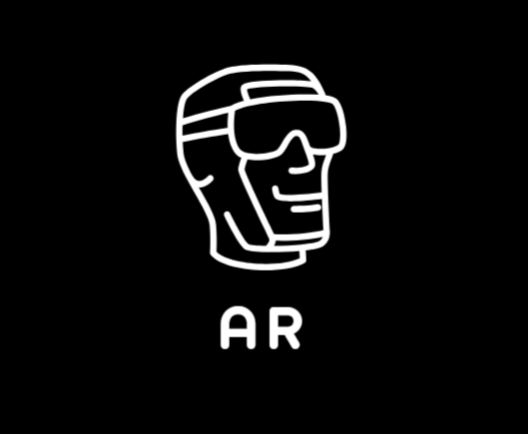

# 🦾 AUGMINT - AR Model Viewer

<div align="center">



**A cutting-edge Augmented Reality web application for interactive 3D model visualization**

[](https://reactjs.org/)
[](https://threejs.org/)
[](https://vitejs.dev/)
[](https://tailwindcss.com/)

[🚀 Live Demo](https://augmint.vercel.app) • [📖 Documentation](#documentation) • [🐛 Report Bug](https://github.com/Hike-12/augmint/issues)

</div>

## ✨ Features

### 🎯 Core Functionality
- **Real-time AR Experience**: Overlay 3D models on live camera feed
- **Interactive 3D Controls**: Rotate, zoom, and pan models with intuitive gestures
- **Multiple Animal Models**: Choose from Bear, Elk, Owl, Panther, and Horse
- **Cross-Platform Camera**: Seamless front/back camera switching
- **Photo Capture**: Save AR screenshots with embedded 3D models

### 📱 Mobile-First Design
- **Responsive Layout**: Optimized for mobile, tablet, and desktop
- **Touch Gestures**: Native mobile touch controls for 3D interaction
- **Adaptive UI**: Smart button sizing and layout adjustments
- **Performance Optimized**: Efficient rendering on mobile devices

### 🎨 User Experience
- **Modern Interface**: Clean, professional design with dark theme
- **Intuitive Controls**: Easy-to-use sidebar and control buttons
- **Real-time Feedback**: Visual indicators for active states
- **Help System**: Built-in tutorial and control guide

## 🚀 Quick Start

### Prerequisites
- Node.js 18+ and npm/yarn
- Modern web browser with WebGL support
- Camera-enabled device for full AR experience

### Installation

1. **Clone the repository**
   ```bash
   git clone https://github.com/yourusername/augmint.git
   cd augmint/ar-model-viewer
   ```

2. **Install dependencies**
   ```bash
   npm install
   # or
   yarn install
   ```

3. **Start development server**
   ```bash
   npm run dev
   # or
   yarn dev
   ```

4. **Open in browser**
   ```
   http://localhost:5173
   ```

### Production Build

```bash
# Build for production
npm run build

# Preview production build
npm run preview
```

## 📱 Usage Guide

### Getting Started
1. **Allow Camera Access**: Grant camera permissions when prompted
2. **Select Model**: Click the menu button (☰) to choose from available 3D models
3. **Activate Controls**: Press "Control Model" to enable 3D interaction
4. **Interact**: Use touch gestures or mouse to manipulate the model
5. **Capture**: Take photos with the camera button

### Controls Overview

| Action | Mobile | Desktop |
|--------|--------|---------|
| **Rotate Model** | One finger drag | Left mouse drag |
| **Zoom In/Out** | Pinch gesture | Mouse wheel |
| **Pan Model** | Two finger drag | Right mouse drag |
| **Switch Camera** | Tap 🔄 button | Click 🔄 button |
| **Take Photo** | Tap 📷 button | Click 📷 button |

## 🛠️ Technology Stack

### Frontend Framework
- **React 19.1.0** - Modern UI library with hooks
- **Vite 6.3.5** - Lightning-fast build tool
- **JavaScript (ES2020+)** - Modern JavaScript features

### 3D Graphics & AR
- **Three.js 0.176.0** - WebGL 3D graphics library
- **GLTF Loader** - 3D model loading and parsing
- **Orbit Controls** - Interactive camera controls
- **WebGL Renderer** - Hardware-accelerated rendering

### Styling & UI
- **Tailwind CSS 4.1.7** - Utility-first CSS framework
- **Lucide React** - Beautiful icon library
- **Responsive Design** - Mobile-first approach
- **Dark Theme** - Professional dark color scheme

### Media & Interaction
- **WebRTC Camera API** - Real-time camera access
- **Canvas API** - Image capture and processing
- **Touch Events** - Mobile gesture support
- **File Download API** - Photo saving functionality

## 📁 Project Structure

```
ar-model-viewer/
├── public/                 # Static assets
│   ├── bear/              # Bear 3D model files
│   ├── elk/               # Elk 3D model files
│   ├── owl/               # Owl 3D model files
│   ├── panther/           # Panther 3D model files
│   ├── horse/             # Horse 3D model files
│   └── logo.png           # App logo
├── src/                   # Source code
│   ├── App.jsx            # Main application component
│   ├── main.jsx           # React entry point
│   └── index.css          # Global styles
├── index.html             # HTML template
├── package.json           # Dependencies and scripts
└── vite.config.js         # Vite configuration
```

## 🎨 Model Assets

All 3D models are licensed under CC-BY-4.0 and properly attributed:

- **Bear** - Wild Mesh (No Rig/Animations) by WildMesh 3D Free
- **Elk** - Wild Mesh (No Rig/Animations) by WildMesh 3D Free  
- **Owl** - Realistic Owl 3D Model by WildMesh 3D Free
- **Panther** - Realistic Panther 3D Model by WildMesh 3D Free
- **Horse** - Horse Free Download by pgonarg

*View individual license files in each model's public folder for full attribution.*

## 🔧 Configuration

### Environment Setup
The app works out-of-the-box with default settings. For custom configurations:

1. **Model Paths**: Update the `models` array in `App.jsx`
2. **Camera Settings**: Modify constraints in the `setupCamera` function
3. **3D Scene**: Adjust lighting and camera settings in the Three.js setup

### Performance Tuning
- **Pixel Ratio**: Automatically limited to 2x for mobile performance
- **Model Scaling**: Responsive scaling based on screen size
- **Control Sensitivity**: Adjusted for mobile vs desktop interaction

## 🌐 Browser Support

| Browser | Mobile | Desktop | Notes |
|---------|--------|---------|-------|
| **Chrome** | ✅ | ✅ | Recommended |
| **Safari** | ✅ | ✅ | iOS 14+ required |
| **Firefox** | ✅ | ✅ | Full support |
| **Edge** | ✅ | ✅ | Chromium-based |

**Requirements:**
- WebGL support
- Camera API support
- ES2020+ JavaScript support

## 🚀 Deployment

### Vercel (Recommended)
1. Connect GitHub repository to Vercel
2. Auto-deploy on push to main branch
3. Ensure all model files are in the `public` directory

### Manual Deployment
```bash
npm run build
# Upload dist/ folder to your hosting provider
```

## 🤝 Contributing

We welcome contributions! Please follow these steps:

1. **Fork the repository**
2. **Create a feature branch** (`git checkout -b feature/amazing-feature`)
3. **Commit changes** (`git commit -m 'Add amazing feature'`)
4. **Push to branch** (`git push origin feature/amazing-feature`)
5. **Open a Pull Request**

### Development Guidelines
- Follow existing code style and conventions
- Test on multiple devices and browsers
- Ensure responsive design principles
- Add comments for complex 3D graphics code

## 📜 License

This project is licensed under the MIT License - see the [LICENSE](LICENSE) file for details.

### Model Licenses
All 3D models are used under CC-BY-4.0 license with proper attribution. See individual license files in the `public` folders.

## 🙏 Acknowledgments

- **Three.js Community** - For the amazing 3D graphics library
- **Sketchfab Artists** - For providing high-quality 3D models
- **React Team** - For the excellent frontend framework
- **Tailwind CSS** - For the utility-first CSS framework

## 📞 Support

Having issues? We're here to help!

- 📧 **Email**: support@augmint.dev
- 🐛 **Issues**: [GitHub Issues](https://github.com/yourusername/augmint/issues)
- 💬 **Discussions**: [GitHub Discussions](https://github.com/yourusername/augmint/discussions)

---

<div align="center">

**Made with ❤️ by [Your Name](https://github.com/yourusername)**

[](https://github.com/yourusername/augmint)
[](https://twitter.com/yourusername)

</div>
